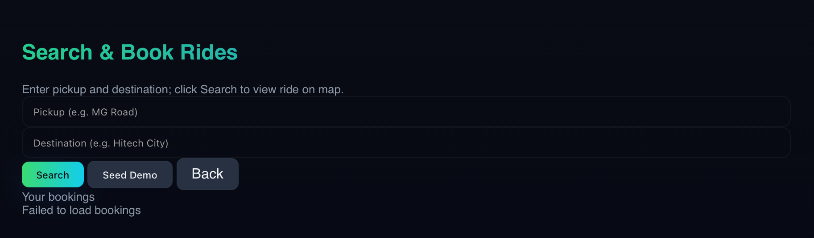
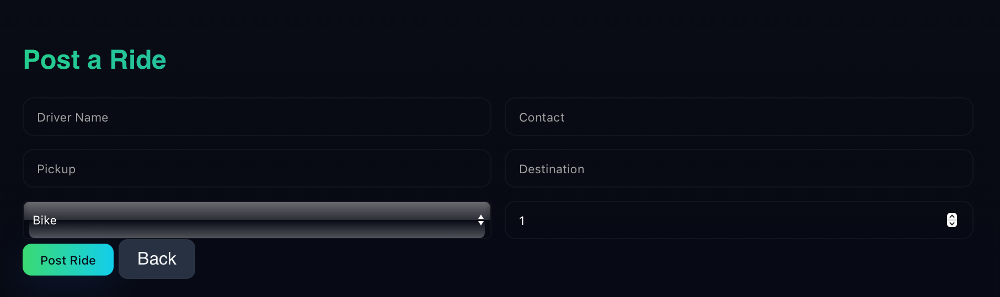

---

# 🚗 **GoTogether - Carpooling & Ride Sharing Platform**

A modern and intuitive web application built using **Node.js + Express** (backend) and **Tailwind CSS with gradients and dark mode** (frontend). Users can either **Book a Ride** or **Post a Ride** using a smooth multi-page UI with animations and a visually engaging design.

---

## 🌟 **Features**

✅ Beautiful Dark Theme with Gradient UI
✅ Multi-page Routing (Landing → Book Ride / Post Ride)
✅ TailwindCSS via CDN (no build process needed)
✅ Smooth Transitions and Modern UX
✅ Date & Time Picker for scheduling rides

---

## 📸 **UI Screenshots**

> *(Replace placeholders with actual screenshots after running the app)*

### 🏠 Landing Page


* Big centered logo
* Two buttons: **Book a Ride** | **Post a Ride**
* Gradient heading and smooth animations

### 🚕 Book Ride Page



* Fields: Pickup, Destination, Date, Time
* Search functionality
* Responsive card results with dark theme

### 🚘 Post Ride Page



* Fields: Start, Destination, Date, Time, Seats
* Submit ride form
* Animated success message

---

## 🗂️ **Project Structure**

```bash
GoTogether/
├── public/
│   ├── index.html       # Landing page
│   ├── book.html        # Book a ride page
│   ├── post.html        # Post a ride page
│   └── styles.css       # Tailwind-based styling
├── server.js            # Node.js Express server with routing
├── package.json
└── README.md
```

---

## 🚀 **How to Run the Project**

### 1️⃣ Install Dependencies

```bash
npm install
```

### 2️⃣ Start Server

```bash
npm start
```

Server will run at 👉 **[http://localhost:3000](http://localhost:3000)**

---

## 🔧 Technologies Used

| Technology         | Purpose        |
| ------------------ | -------------- |
| Node.js + Express  | Backend Server |
| Tailwind CSS (CDN) | UI Styling     |
| HTML/CSS/JS        | Frontend pages |

---

## 🔮 Future Enhancements

* ✅ Add user authentication (Login / Sign Up)
* ✅ Ride matching suggestions using AI
* ✅ Payment integration
* ✅ Google Maps live tracking

---

## 👨‍💻 Author

**Manish Kumar**
*Passionate developer in AI, Full Stack, and Software Development.*

---

## ❤️ Contribution & Feedback

Contributions, issues, and feature requests are welcome!
Feel free to ⭐ the repository if you like the project.

---

