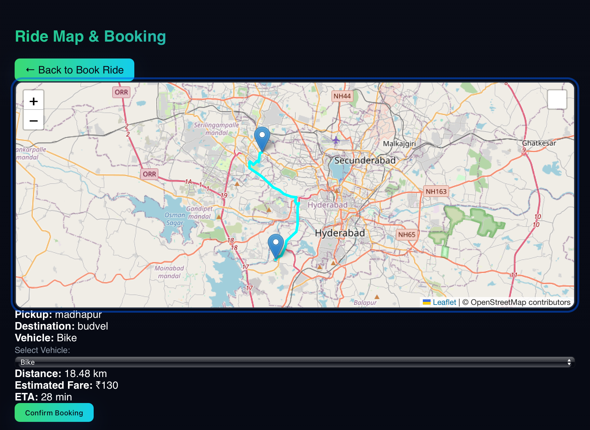

---

# 🚗 **GoTogether - Carpooling & Ride Sharing Platform**

A modern and intuitive web application built using **Node.js + Express** (backend) and **Tailwind CSS** (frontend). Users can **Book a Ride** or **Post a Ride** with a smooth multi-page UI, live ride map visualization, real-time booking updates, and visually engaging animations.

---

## 🌟 **Features**

*✅ Beautiful Dark Theme with Gradient UI
*✅ Multi-page Routing (Landing → Book Ride / Post Ride → Ride Map)
*✅ TailwindCSS via CDN (no build process needed)
*✅ Smooth Transitions and Modern UX
*✅ Live Ride Map Integration with Google Maps / Alternative APIs
*✅ Booking confirmation with name & contact validation
*✅ Responsive design for desktop and mobile
*✅ Date & Time Picker for scheduling rides
*✅ Real-time seat availability updates

---

## 📸 **UI Screenshots / Image Placeholders**

> Replace these placeholders with screenshots after running the app locally.

### 🏠 Landing Page


*Centered logo, two main buttons: Book a Ride | Post a Ride, gradient headings, smooth animations.*

---

### 🚕 Book Ride Page


*Fields: Pickup, Destination, Date, Time.
Search results cards with responsive layout, dark theme, and hover animations.*

---

### 🚘 Post Ride Page


*Fields: Start, Destination, Vehicle, Seats.
Submit ride form with animated success confirmation.*

---

### 🗺️ Ride Map Page


*Interactive map displaying available rides.
Markers for pickup/destination and dynamic updates of available seats.*

---

## 🗂️ **Project Structure**

```bash
GoTogether/
├── public/
│   ├── index.html        # Landing page
│   ├── book.html         # Book a ride page
│   ├── post.html         # Post a ride page
│   ├── ride-map.html     # Interactive ride map page
│   └── styles.css        # Tailwind-based styling
├── server.js             # Node.js Express server with routing & API
├── package.json
├── .env                  # MongoDB Atlas connection
└── README.md
```

---

## 🚀 **How to Run the Project**

### 1️⃣ Install Dependencies

```bash
npm install
```

### 2️⃣ Start Server

```bash
npm start
```

Server will run at 👉 **[http://localhost:4000](http://localhost:4000)**

> Make sure `.env` contains your MongoDB Atlas connection string:

```env
MONGO_URI=<your-mongodb-atlas-connection-string>
PORT=4000
```

---

## 🔧 Technologies Used

| Technology            | Purpose                           |
| --------------------- | --------------------------------- |
| Node.js + Express     | Backend API and server            |
| MongoDB Atlas         | Database for rides & bookings     |
| Tailwind CSS (CDN)    | Frontend styling & responsiveness |
| HTML/CSS/JS           | Multi-page frontend               |
| Google Maps / Leaflet | Interactive map functionality     |

---

## 🔮 Recent Updates / New Features

* Live ride map page with markers for rides
* Booking form validation for rider name and contact
* Real-time seat availability update after bookings
* Smooth animations for posting & booking rides
* Responsive UI improvements for mobile screens
* Fixed ride posting and booking API issues

---

## 🔮 Future Enhancements

* ✅ Add user authentication (Login / Sign Up)
* ✅ AI-based ride suggestions
* ✅ Payment integration
* ✅ Route optimization and ETA
* ✅ Push notifications for ride updates

---

## 👨‍💻 Author

**Manish Kumar**
*Passionate developer in AI, Full Stack, and Software Development.*

---

## ❤️ Contribution & Feedback

Contributions, issues, and feature requests are welcome!
Feel free to ⭐ the repository if you like the project.

---
